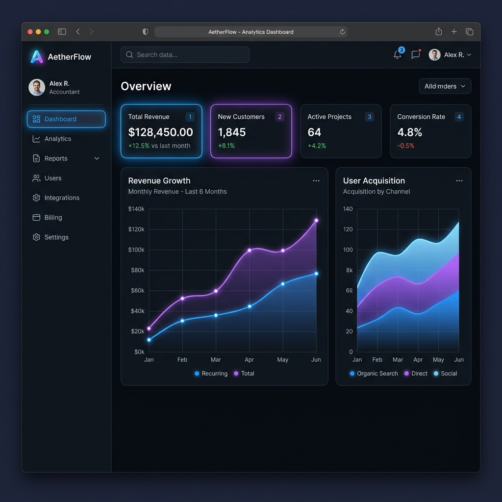

# MockXen 🌟

> A premium, fully client-side browser and mobile screenshot mockup generator with dynamic ambient glows and 3D parallax tilt effects.



## Features

- **Dynamic Ambient Glow**: Customizable background styling with preset gradients or custom color blends.
- **3D Mouse Parallax Tilt**: Smooth, interactive 3D perspective rotation on hover that reacts to your mouse cursor position.
- **Multiple Device Frame Options**: Choose between macOS-style Chrome browser frames, realistic MacBook Pro casings, or mobile screen sizes.
- **Zero Server Overhead**: 100% client-side rendering utilizing `html-to-image` for high-fidelity exports.
- **Micro-Animations**: Clean and responsive hover transitions built on a flexible vanilla CSS Design System.

## Tech Stack

- **Framework**: [React](https://react.dev/) + [Vite](https://vite.dev/)
- **Styling**: Vanilla CSS Design System with custom design tokens for absolute control and flexibility.
- **Icons**: [Lucide React](https://lucide.dev/)
- **Image Export**: [html-to-image](https://github.com/bubkoo/html-to-image)

## Getting Started

### Installation

Clone the repository and install the dependencies:

```bash
npm install
```

### Run Locally

Launch the Vite development server:

```bash
npm run dev
```

### Production Build

Build the optimized application bundle for production:

```bash
npm run build
```

### Preview Build

Preview the production build locally:

```bash
npm run preview
```

## License

MIT License. See [LICENSE](LICENSE) for more details.
